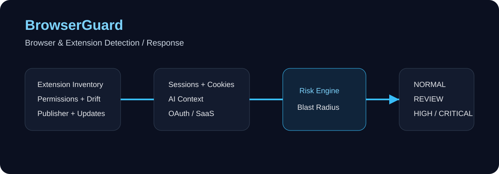
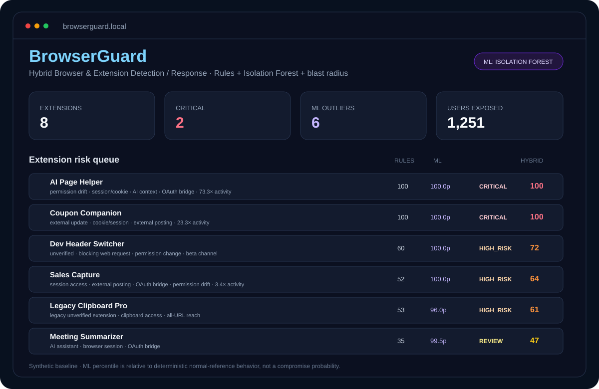
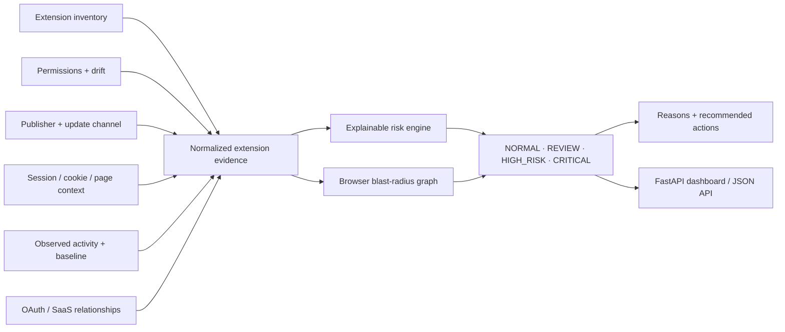

<div align="center">

# BrowserGuard

### Browser & Extension Detection / Response

**A defensive browser-security lab for extension inventory, permission drift, session exposure, risky update signals, AI-extension risk, browser-to-OAuth/SaaS paths, and explainable response decisions.**

[](https://github.com/VinayK88/BrowserGuard/actions/workflows/ci.yml)
[](https://www.python.org/)
[](#what-browserguard-is-used-for)
[](#browser-blast-radius)
[](#security--evaluation-boundary)

**Extension permissions · update drift · cookies/sessions · AI assistants · OAuth/SaaS reach · blast radius**

[Overview](#overview) · [Dashboard](#dashboard-preview) · [Evidence](#baseline-evidence) · [Architecture](#architecture) · [Risk Model](#risk-model) · [API](#api--dashboard) · [Quick Start](#quick-start)

</div>

---



## Dashboard preview



> Static preview of the built-in FastAPI dashboard using the checked-in **synthetic baseline**. Run `uvicorn browserguard.api:app --reload` and open `/` for the live local dashboard.

---

## Overview

BrowserGuard treats the browser as a **security control plane**, not just a client application.

A browser extension can gain new permissions, observe authenticated sessions, read cookies, inject scripts into pages, access clipboard data, call external services, bridge into OAuth/SaaS applications, or handle sensitive context on behalf of an AI assistant.

> **Core question:** If this extension changes, misbehaves, or becomes untrusted, what browser sessions, users, and SaaS resources are exposed?

```text
Browser extension
      │
      ├── publisher trust
      ├── permissions
      ├── permission drift
      ├── update channel
      ├── session / cookie access
      ├── AI-assistant context
      ├── outbound posting
      ├── OAuth / SaaS bridge
      └── observed activity vs baseline
                    │
                    ▼
               BrowserGuard
                    │
          ┌─────────┼──────────┐
          ▼         ▼          ▼
       Risk      Reasons    Blast radius
          │         │          │
          └─────────┼──────────┘
                    ▼
      NORMAL / REVIEW / HIGH_RISK / CRITICAL
```

BrowserGuard deliberately combines **static posture** and **behavioral evidence**. A broad permission set matters, but its urgency changes when permissions were recently expanded, the publisher is unverified, the extension has cookie/session access, or observed activity suddenly deviates from baseline.

---

## What BrowserGuard is used for

| Use case | Defensive question |
| --- | --- |
| **Extension inventory** | Which extensions are installed and which users depend on them? |
| **Permission drift** | Did an update introduce materially broader privileges? |
| **Session exposure** | Which extensions can observe authenticated browser state or cookies? |
| **AI-extension review** | Which assistants can read sensitive page context or send it externally? |
| **Update-chain risk** | Is an extension running from a non-standard or unexpected update channel? |
| **Browser-to-SaaS paths** | Can an extension bridge browser context into OAuth or SaaS access? |
| **Behavior anomaly triage** | Is extension activity materially different from its normal baseline? |
| **Blast-radius analysis** | How many users and downstream browser/SaaS resources sit behind one extension? |

---

## Baseline evidence

The repository contains **8 deterministic synthetic extensions** spanning benign, review, high-risk, and critical patterns.

| Measure | Current baseline |
| --- | ---: |
| Extensions evaluated | **8** |
| Expected outcomes matched | **8 / 8** |
| Critical | **2** |
| High risk | **3** |
| Review | **1** |
| Normal | **2** |
| Mean risk score | **50.0 / 100** |
| Users behind high-risk or critical extensions | **1,251** |
| Highest-risk extensions | **AI Page Helper / Coupon Companion — 100 / 100** |
| Unit tests | **8 / 8 passing locally** |

The checked-in report is [`reports/baseline.json`](reports/baseline.json).

> All values are synthetic project evidence. They verify implementation and decision logic; they are not measurements from real Chrome, Edge, Firefox, Safari, enterprise browser, or SaaS tenants.

### Synthetic outcomes

| Extension | Pattern | Decision |
| --- | --- | ---: |
| `AI Page Helper` | unverified publisher + permission expansion + cookie/session access + AI context + external posting + OAuth bridge + 73.3× activity | **CRITICAL · 100** |
| `Coupon Companion` | unverified publisher + permission expansion + cookie/session access + external posting + 23.3× activity | **CRITICAL · 100** |
| `Dev Header Switcher` | unverified publisher + blocking web request access + permission change + beta channel | **HIGH_RISK · 60** |
| `Legacy Clipboard Pro` | legacy unverified extension + clipboard access + all-URL reach | **HIGH_RISK · 53** |
| `Sales Capture` | session access + external posting + OAuth bridge + permission drift + 3.4× activity | **HIGH_RISK · 52** |
| `Meeting Summarizer` | AI assistant + browser-session + OAuth bridge | **REVIEW · 35** |
| `Calendar Notes` | narrow stable permissions | **NORMAL · 0** |
| `PDF Toolkit` | narrow download/storage permissions | **NORMAL · 0** |

---

## Architecture



---

## Risk model

The score is intentionally transparent rather than presented as a breach probability.

```text
risk =
    permission sensitivity
  + publisher uncertainty
  + permission drift
  + update-channel risk
  + session exposure
  + cookie exposure
  + external posting
  + OAuth/SaaS bridge
  + AI-context interaction
  + activity deviation
  + user blast radius
```

### Decision states

| Decision | Meaning |
| --- | --- |
| `NORMAL` | Low-risk synthetic baseline. |
| `REVIEW` | Requires owner or policy review. |
| `HIGH_RISK` | Multiple material risk signals warrant prioritized investigation. |
| `CRITICAL` | Combined privileges, trust, behavior, and reach support immediate investigation. |

---

## Browser blast radius

For a synthetic risky AI assistant:

```text
AI Page Helper
      │
      ├── 612 users
      ├── browser sessions
      ├── cookies
      ├── AI page context
      ├── OAuth grants
      └── downstream SaaS apps
```

The graph layer answers a different question from the score:

> **What could be affected if this extension becomes untrusted?**

A production version could expand profiles, groups, browser policies, extension versions, allowed domains, OAuth grants, SaaS data classification, managed/unmanaged devices, and extension-update provenance.

---

## Example critical finding

```text
BROWSERGUARD FINDING

Extension               AI Page Helper
Publisher verified      NO
Update channel          external
Active users            612

Permissions
- tabs
- cookies
- scripting
- <all_urls>

Permission drift        +3
Session access          YES
Cookie access           YES
AI assistant            YES
External posting        YES
OAuth / SaaS bridge     YES

Observed activity       8,800
Baseline activity       120
Deviation               73.3x

Risk                    CRITICAL
Score                   100 / 100
```

---

## Input → output example

```text
GET /extensions/ext-002
```

```json
{
  "assessment": {
    "ext_id": "ext-002",
    "name": "AI Page Helper",
    "decision": "CRITICAL",
    "risk_score": 100,
    "api_ratio": 73.3,
    "users_exposed": 612
  },
  "blast_radius": {
    "users": 612,
    "resources": ["browser-session", "cookies", "oauth-grants", "saas-apps", "ai-context"],
    "nodes": 618,
    "edges": 617
  }
}
```

---

## API & dashboard

```bash
pip install -e '.[api]'
uvicorn browserguard.api:app --reload
```

Endpoints:

```text
GET /healthz
GET /report
GET /extensions
GET /extensions/{ext_id}
GET /docs
```

---

## Quick start

```bash
git clone https://github.com/VinayK88/BrowserGuard.git
cd BrowserGuard
python -m venv .venv
source .venv/bin/activate
pip install -e '.[api]'
browserguard
python -m unittest discover -s tests -v
uvicorn browserguard.api:app --reload
```

Docker:

```bash
docker build -t browserguard .
docker run --rm -p 8000:8000 browserguard
```

---

## How this differs from adjacent projects

```text
SaaSGraph     → third-party OAuth/SaaS trust relationships
MacSentinel   → endpoint security analytics on macOS
AgentShield   → runtime AI-agent tool-call security
BrowserGuard  → browser extensions, sessions, permission drift, and browser-to-SaaS paths
```

BrowserGuard owns a separate portfolio category: **enterprise browser security and extension detection/response**.

---

## Security & evaluation boundary

**Everything in this repository is synthetic and defensive.**

BrowserGuard does not install extensions, collect real cookies, extract session tokens, access browser histories, intercept user traffic, modify enterprise browser policy, enumerate private SaaS data, or execute offensive browser techniques.

---

<div align="center">

### The browser is an identity and data boundary—not just a UI.

**Browser Security · Extension Security · Identity · SaaS Exposure · Detection & Response**

</div>
