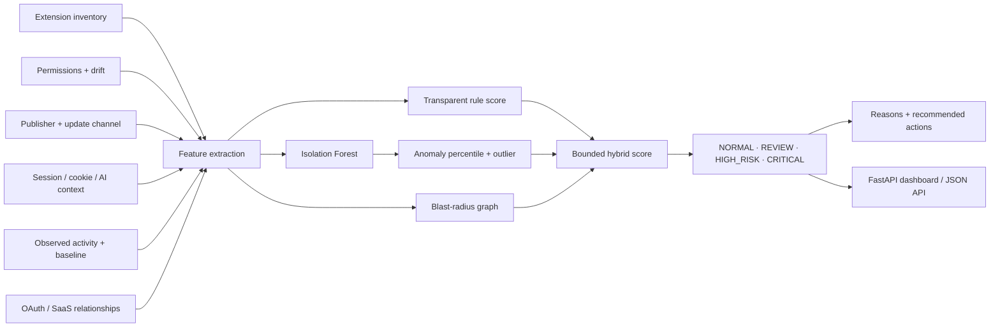

<div align="center">

# BrowserGuard

### Browser & Extension Detection / Response with Hybrid ML

**A defensive browser-security lab for extension inventory, permission drift, session exposure, risky update signals, AI-extension risk, browser-to-OAuth/SaaS paths, and explainable ML-assisted response decisions.**

[](https://github.com/VinayK88/BrowserGuard/actions/workflows/ci.yml)
[](https://www.python.org/)
[](#hybrid-ml-risk-model)
[](#what-browserguard-is-used-for)
[](#security--evaluation-boundary)

**Rules · Isolation Forest · permission drift · cookies/sessions · AI assistants · OAuth/SaaS reach · blast radius**

[Dashboard](#dashboard-preview) · [ML Model](#hybrid-ml-risk-model) · [Evidence](#baseline-evidence) · [Architecture](#architecture) · [API](#api--dashboard) · [Quick Start](#quick-start)

</div>

---


## Dashboard preview


> Static preview of the built-in FastAPI dashboard using the checked-in **synthetic baseline**. The UI exposes the final hybrid score, transparent rule score, Isolation Forest anomaly percentile, and outlier state.

---

## Overview

BrowserGuard treats the browser as a **security control plane**, not just a client application.

A browser extension can gain new permissions, observe authenticated sessions, read cookies, inject scripts into pages, access clipboard data, call external services, bridge into OAuth/SaaS applications, or handle sensitive context on behalf of an AI assistant.

> **Core question:** If this extension changes, behaves abnormally, or becomes untrusted, what browser sessions, users, and SaaS resources are exposed?

BrowserGuard now combines three evidence layers:

```text
Extension posture / policy
          │
          ├── permissions
          ├── publisher trust
          ├── permission drift
          └── update channel
          │
          ▼
     Transparent rules ──────────────┐
                                     │
Behavior + reach                     │
          │                          ▼
          ├── event ratio       Hybrid risk
          ├── session/cookies  = rule score
          ├── AI context         + bounded ML adjustment
          ├── OAuth bridge             │
          └── graph reach               ▼
          │                    NORMAL / REVIEW /
          ▼                    HIGH_RISK / CRITICAL
  Isolation Forest
  anomaly percentile
```

The ML layer does **not** replace policy. It adds bounded priority when behavior is unusual relative to a deterministic normal-reference population.

---

## What BrowserGuard is used for

| Use case | Defensive question |
| --- | --- |
| **Extension inventory** | Which extensions are installed and which users depend on them? |
| **Permission drift** | Did an update introduce materially broader privileges? |
| **Session exposure** | Which extensions can observe authenticated browser state or cookies? |
| **Behavior anomaly detection** | Is current extension behavior unusual relative to learned normal-reference behavior? |
| **AI-extension review** | Which assistants can read sensitive page context or send it externally? |
| **Update-chain risk** | Is an extension running from a non-standard or unexpected update channel? |
| **Browser-to-SaaS paths** | Can an extension bridge browser context into OAuth or SaaS access? |
| **Blast-radius analysis** | How many users and downstream browser/SaaS resources sit behind one extension? |

---

## Hybrid ML risk model

BrowserGuard uses a **hybrid rules + unsupervised ML** design.

### 1. Transparent rule score

The deterministic layer evaluates permission sensitivity, publisher uncertainty, permission drift, update-channel risk, session/cookie exposure, external posting, OAuth/SaaS reach, AI-context interaction, event-volume deviation, and user blast radius. The output remains available as `rule_score`.

### 2. Isolation Forest anomaly model

`browserguard/ml.py` trains an Isolation Forest on **800 deterministic synthetic normal-reference profiles** using a fixed random seed.

The 14 model features are `permission_sensitivity`, `permission_count`, `permission_delta`, `publisher_unverified`, `update_risk`, `log_age_days`, `log_active_users`, `session_access`, `cookie_access`, `ai_assistant`, `external_posting`, `oauth_bridge`, `log_event_ratio`, and `resource_count`.

The model returns `ml_anomaly_score`, `ml_outlier`, and `top_feature_deviations`. **The anomaly score is not a probability of compromise.**

### 3. Bounded ML adjustment

| ML anomaly percentile | Risk adjustment |
| --- | ---: |
| `< 85` | `+0` |
| `85–94.9` | `+4` |
| `95–98.9` | `+8` |
| `>= 99` | `+12` |

```text
hybrid_risk = min(100, rule_score + ml_adjustment)
```

This prevents the model from silently overriding explicit security evidence.

---

## Baseline evidence

The repository contains **8 deterministic synthetic extensions** spanning benign, review, high-risk, and critical patterns.

| Measure | Current baseline |
| --- | ---: |
| Extensions evaluated | **8** |
| Expected outcomes matched | **8 / 8** |
| Critical | **2** |
| High risk | **3** |
| Review | **1** |
| Normal | **2** |
| Mean hybrid risk score | **55.5 / 100** |
| Isolation Forest outliers | **6 / 8** |
| Mean ML anomaly percentile | **79.4** |
| Users behind high-risk or critical extensions | **1,251** |
| Hybrid decisions changed vs rules | **0** |
| Unit tests | **13 / 13** |

The checked-in [`reports/baseline.json`](reports/baseline.json) is validated against executable output in CI by [`scripts/verify_baseline.py`](scripts/verify_baseline.py).

### Synthetic outcomes

| Extension | Rule | ML anomaly | Hybrid | Decision |
| --- | ---: | ---: | ---: | --- |
| `AI Page Helper` | 100 | 100.0p | **100** | **CRITICAL** |
| `Coupon Companion` | 100 | 100.0p | **100** | **CRITICAL** |
| `Dev Header Switcher` | 60 | 100.0p | **72** | **HIGH_RISK** |
| `Sales Capture` | 52 | 100.0p | **64** | **HIGH_RISK** |
| `Legacy Clipboard Pro` | 53 | 96.0p | **61** | **HIGH_RISK** |
| `Meeting Summarizer` | 35 | 99.5p | **47** | **REVIEW** |
| `Calendar Notes` | 0 | 10.6p | **0** | **NORMAL** |
| `PDF Toolkit` | 0 | 29.1p | **0** | **NORMAL** |

> All values are synthetic project evidence. They verify implementation and decision logic; they are not real Chrome, Edge, Firefox, Safari, enterprise-browser, or SaaS measurements.

---

## Architecture



---

## Explainability

For each extension, BrowserGuard keeps the ML contribution explicit. For example, `Sales Capture` has a rule score of **52**, an ML anomaly percentile of **100.0**, a `+12` ML adjustment, and a hybrid score of **64**. The model also reports its largest standardized deviations from the synthetic normal reference.

The standardized deviations are **diagnostic context, not SHAP values or causal attribution**.

---

## Browser blast radius

The score asks **how concerning is this extension?** The graph asks **what could be affected if it becomes untrusted?**

For the synthetic `AI Page Helper`, the modeled reach includes **612 users**, browser sessions, cookies, AI page context, OAuth grants, and downstream SaaS apps.

---

## API & dashboard

```bash
pip install -e '.[api]'
uvicorn browserguard.api:app --reload
```

Endpoints:

```text
GET /healthz
GET /report
GET /extensions
GET /extensions/{ext_id}
GET /docs
```

The dashboard shows hybrid score, rule score, ML anomaly percentile, outlier status, top risk reasons, critical counts, and exposed users.

---

## Quick start

```bash
git clone https://github.com/VinayK88/BrowserGuard.git
cd BrowserGuard
python -m venv .venv
source .venv/bin/activate
pip install -e '.[api]'
browserguard
python -m unittest discover -s tests -v
python scripts/verify_baseline.py
uvicorn browserguard.api:app --reload
```

Docker:

```bash
docker build -t browserguard .
docker run --rm -p 8000:8000 browserguard
```

---

## Engineering & quality

- Python **3.10 / 3.11 / 3.12** CI matrix
- deterministic synthetic ML training corpus
- fixed model random state
- reproducible checked-in baseline
- baseline-vs-executable CI verification
- unit tests for rule and ML behavior
- FastAPI route validation
- CLI smoke test
- package compilation check
- Docker support
- explicit synthetic/security boundary

---

## Repository map

```text
browserguard/
  api.py          FastAPI + dashboard
  engine.py       hybrid decision engine
  features.py     shared feature extraction
  fixtures.py     synthetic extension scenarios
  ml.py           Isolation Forest model + explanations
  models.py       typed extension / assessment models
  report.py       machine-readable evaluation report

tests/
  test_engine.py

reports/
  baseline.json

scripts/
  verify_baseline.py

docs/
  methodology.md
  ml-methodology.md

assets/
  browserguard-overview.svg
  dashboard-preview.svg
```

---

## How this differs from adjacent projects

```text
SaaSGraph     → third-party OAuth/SaaS trust relationships
MacSentinel   → endpoint security analytics on macOS
AgentShield   → runtime AI-agent tool-call security
BrowserGuard  → browser extensions, sessions, behavioral ML, permission drift,
                and browser-to-SaaS paths
```

BrowserGuard owns a separate portfolio category: **enterprise browser security and extension detection/response**.

---

## Security & evaluation boundary

**Everything in this repository is synthetic and defensive.**

BrowserGuard does not install extensions, collect real cookies, extract session tokens, access browser histories, intercept user traffic, modify enterprise browser policy, enumerate private SaaS data, or execute offensive browser techniques.

The Isolation Forest is trained only on deterministic synthetic normal-reference profiles. The baseline does **not** establish production precision, recall, false-positive rate, or probability of compromise.

---

<div align="center">

### The browser is an identity and data boundary—not just a UI.

**Browser Security · Extension Security · Machine Learning · Identity · SaaS Exposure · Detection & Response**

</div>
